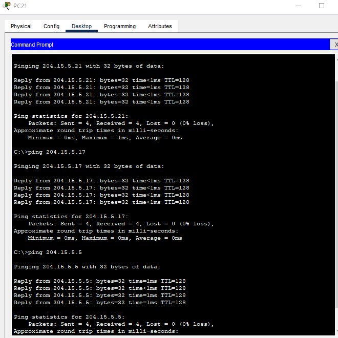

# Cisco University LAN Network Design

## 📌 Project Overview
A Cisco-based University Local Area Network (LAN) designed and implemented in Cisco Packet Tracer for a three-floor university environment.

The project focuses on designing an efficient IP addressing scheme, subnetting a Class C network, configuring Cisco networking devices, and enabling communication between different network segments.

**Completed:** 2024
**Project Type:** Academic / Computer Engineering
**Tool:** Cisco Packet Tracer

## 🎯 Objectives

* Design a functional three-floor university LAN.
* Apply IP subnetting to efficiently allocate network addresses.
* Configure routers and switches.
* Connect PCs and laptops across different network segments.
* Enable communication between devices on the same and different subnets.
* Test and verify network connectivity.

## 🌐 Network Architecture

The network uses a **hierarchical star topology**, with each floor containing switches connected to a central router.

### Network Components

* 1 Cisco Router
* 7 Cisco Switches
* 72 PCs
* 28 Laptops
* Copper straight-through cables
* Cisco Packet Tracer

### Floor Structure

| Floor        | Main Network Segment                      |   Hosts |
| ------------ | ----------------------------------------- | ------: |
| Ground Floor | Staff offices, laboratories/lecture areas |     30+ |
| 1st Floor    | Laboratories & staff offices              | 30 + 14 |
| 2nd Floor    | Micro labs, staff offices & seminar areas |      25 |

## 🧮 IP Subnetting

The original Class C network was:

**204.15.5.0/24**

The network was divided into smaller subnets according to the number of hosts required by each section.

### Subnet Allocation

| Network               | Subnet          | Subnet Mask     | Usable Host Range           | Broadcast    |
| --------------------- | --------------- | --------------- | --------------------------- | ------------ |
| Ground Floor          | 204.15.5.0/27   | 255.255.255.224 | 204.15.5.1 – 204.15.5.30    | 204.15.5.31  |
| Ground Floor Reserved | 204.15.5.32/27  | 255.255.255.224 | 204.15.5.33 – 204.15.5.62   | 204.15.5.63  |
| 1st Floor Labs        | 204.15.5.64/27  | 255.255.255.224 | 204.15.5.65 – 204.15.5.94   | 204.15.5.95  |
| 2nd Floor             | 204.15.5.96/27  | 255.255.255.224 | 204.15.5.97 – 204.15.5.126  | 204.15.5.127 |
| 1st Floor Staff       | 204.15.5.128/28 | 255.255.255.240 | 204.15.5.129 – 204.15.5.142 | 204.15.5.143 |
| 2nd Floor Staff/Labs  | 204.15.5.144/28 | 255.255.255.240 | 204.15.5.145 – 204.15.5.158 | 204.15.5.159 |
| Additional Subnet     | 204.15.5.160/28 | 255.255.255.240 | 204.15.5.161 – 204.15.5.174 | 204.15.5.175 |

The subnet sizes were selected according to host requirements, using **/27 networks for larger segments** and **/28 networks for smaller segments**

## 🔧 Router Configuration

The router was configured with interfaces serving the different network segments.

| Interface          | IP Address   | Subnet Mask     |
| ------------------ | ------------ | --------------- |
| GigabitEthernet0/0 | 204.15.5.1   | 255.255.255.224 |
| GigabitEthernet0/1 | 204.15.5.65  | 255.255.255.224 |
| FastEthernet0/0/0  | 204.15.5.129 | 255.255.255.240 |
| GigabitEthernet0/2 | 204.15.5.145 | 255.255.255.240 |

The router acts as the gateway between the different subnets and enables **inter-subnet communication**.

## 🔀 Switch Configuration

Seven switches were used throughout the three-floor network.

Switches were connected using **Fast Ethernet copper connections**, while router interfaces connected to the main switches on each floor.

Switch configuration included:

* Router-to-switch connections
* Switch-to-switch uplinks
* Host connections
* Port allocation
* Network segment connectivity

## 💻 Host Configuration

The PCs and laptops were configured with **static IPv4 addresses** according to their assigned subnet.

Each host was assigned:

* IP address
* Subnet mask
* Default gateway

This allowed devices to communicate within their subnet and, through the router, with devices on other subnets.

## 🧪 Network Testing

Connectivity was tested using **ICMP ping** between devices on different network segments.

Testing included:

* Same-subnet communication
* Inter-subnet communication
* Ground Floor → 1st Floor
* Ground Floor → 2nd Floor

Successful ping responses were used to verify that the addressing scheme, device configuration and routing were functioning correctly.

## 📸 Project Screenshots

### Network Topology

### Router Configuration

### Switch Configuration

### IP Address Configuration

### Connectivity Testing

## 📁 Project Files

* **`Network-Design.pkt`** — Cisco Packet Tracer network implementation
* **`Report.pdf`** — Complete project report and technical documentation
* **`screenshots/`** — Configuration and testing evidence

## 🧠 Key Concepts Demonstrated

**Networking:**
IP addressing • Subnetting • CIDR • Routing • Switching • LAN design • Network topology

**Practical Configuration:**
Router configuration • Switch configuration • Static IP addressing • Default gateways • Connectivity testing

**Tools:**
Cisco Packet Tracer
